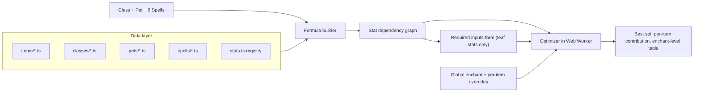

# Idle Wizard Item Optimizer

## Key findings from the wiki research

- There are 203+ items (plus Mythics) across 20 slots: Finger x2, Trophy x2, Weapon, Mount, Phylactery, and so on. Items have 6 qualities, attribute requirements, set bonuses, and enchant levels 0-55. Each enchant level multiplies the item's enchant effect again (e.g. `1.2^level`).
- Some items don't raise mana directly but change other inputs. Resonator Ring gives +4 enchant levels to all equipped items and The Legion gives +1; these only apply to items with at least 1 enchant level. Other items grant attributes, pet level/XP, or efficiencies.
- The community Discord "BiS calculator" (WikiWizard bot, documented on the [BiS Guide](https://idle-wizard.fandom.com/wiki/BiS_Guide)) solves the same problem. It builds a score formula from class, pet, spells and inputs, filters out items that don't affect the score, prunes per slot, tests set permutations, then tries every remaining combination at each enchant level. This plan copies that approach.
- Numbers go past 1e2000, which regular JavaScript numbers can't hold, so the app uses `break_eternity.js` (`Decimal`) and compares scores in log space.
- wiki.gg blocks scripted access through Cloudflare. The old Fandom mirror allows API access but is outdated. Getting the data is a real part of this work.

## Architecture




### Effect model (the core design)

- Every game quantity is a named **stat**, for example `Spell.IncantationEfficiency`, `Hero.AbilityPower`, `Pet.AbilityPower`, `Pet.Level`, `Char.Mastery`, `Items.BonusEnchantLevels`, `Base.IdleBonus`.
- A stat's value is computed as `(base + sum of additive effects) * product of multiplicative effects`. Each effect is a small expression that can reference other stats.
- Classes, pets, spells, items and set bonuses are all lists of effects. A **score** is an expression, e.g. "profit multiplier while the selected spells are active".
- The builder walks from the score to every stat it depends on. Stats that nothing produces become candidate inputs.
- Indirect items work automatically. An item raising `Items.BonusEnchantLevels` changes every enchant multiplier, and an attribute bonus flows into attribute perks, so its value reaches the score without special-casing.
- Item shape (sketch):

```ts
{ id: "resonator-ring", slot: "finger", set: null,
  requirements: { legendary: { spellcraft: 0 } },
  effects: { legendary: [{ stat: "Items.BonusEnchantLevels", op: "add", value: 4 }] },
  enchant: { stat: "...", op: "mul", perLevel: 1.0406 },
  source: "https://idlewizard.wiki.gg/wiki/Resonator_Ring", verified: false }
```

### Only ask for inputs that can change which set wins ([src/engine/relevance.ts](src/engine/relevance.ts))

- Every piece of information the calculation needs gets its **own separate, labelled input** (e.g. "Pet level", "Skipped time (years)", "Spellcraft points"). Values are never bundled into a combined "misc multiplier" field.
- An input is only shown if it can change which item set is best. A parameter that multiplies the score of every set by the same amount (like a flat x2 to all profits) can't change the ranking, so the app leaves it out.
- **Structural check:** take the log of the score, so it becomes a sum of per-factor terms. Any term that references no stat an item can affect is a constant across all sets and gets dropped, together with the inputs that feed only into it.
- **Numeric check** for terms where inputs and item stats are mixed (sums, powers, `log`, `max`): take a few candidate sets, change the input over a range, and see whether the score *ratio* between sets changes. If it never does, the input is hidden.
- Hidden inputs stay available in a collapsed "doesn't affect the ranking" section with an explanation. Because constant factors are dropped, scores are shown as relative multipliers (compared with no items / the previous best), not absolute mana.

### Optimizer ([src/engine/optimizer.ts](src/engine/optimizer.ts), run in a Web Worker)

1. Drop items that don't affect the score, have unmet attribute requirements, sit in unavailable slots, or aren't owned.
2. Per slot, rank items by their score contribution alone (assuming best-case set bonuses) and keep the top candidates (two for Finger and Trophy).
3. Test set subsets against the non-set alternatives, the same way the BiS bot does.
4. Search the remaining combinations with branch-and-bound. Run separate searches with and without Resonator Ring / The Legion, because they change every other item's enchant level.
5. Report the best set, each item's marginal contribution (score with vs. without it), and a table of results across global enchant levels 0-55, like the bot's "Enchant N" output.

### UI ([src/ui/](src/ui/))

- **Setup:** class, pet (common pairings listed first), 6 spells filtered by class, and stances/elixirs/passives where relevant.
- **Inputs:** a form generated from the ranking-relevant inputs only (one field per piece of information), grouped by Character / Pet / Attributes / Spells / Misc. Saved to `localStorage` and encoded in a shareable URL.
- **Items:** global enchant level, per-item overrides, owned items and their quality, and excluded slots (for lower Paragon levels).
- **Results:** as listed in the optimizer section above.

## Data acquisition

- [scripts/scrape/](scripts/scrape/): a Playwright (headless Chromium) script downloads the raw wikitext from wiki.gg for item, class, pet and spell pages into a committed `data-raw/` snapshot. It falls back to the Fandom API for pages it can't get.
- An automatic parser reads the wiki infoboxes for slot, set, quality requirements and attributes.
- Effect formulas (the "Details" sections) are converted into TypeScript by hand, with agent help. Each entry keeps its source link and a `verified` flag.
- If Cloudflare also blocks Playwright, fall back to reading pages manually through the fetch tool, cross-checked against Fandom.

## Coverage for the first version

- All items: structure for every item; effects for everything that touches the stats Oni, Shaman and Temporalist use, plus generic profit, efficiency, attribute and enchant stats.
- Oni, Shaman and Temporalist: hero abilities (e.g. Temporalist's profit and Evocation multipliers based on time and skipped time), stances, and all their spells.
- Pets named in those classes' guides (e.g. Living Sin, Hungerer, Greater Chimaera, Simulacrum, Mechanos Apexis, Archivist), plus whatever the Shaman and Temporalist guides recommend.
- Chronomancer, its spells, and the pet(s) its guide uses. It's only needed for the confidence check below, but it's encoded in the same way, so it stays in the app.

## Validation

- Vitest unit tests for effect evaluation against worked examples from the wiki, such as Enchanting Membrane's quality-tier formula.
- Golden tests for Oni, Shaman and Temporalist: rerun the BiS commands in their guides with the same inputs, and check that the optimizer picks the same (or explainably different) sets.

### Confidence check: blind comparison with the [Chronomancer guide](https://idle-wizard.fandom.com/wiki/Chronomancer)

The point is to test the tool without seeing the answer first.

1. **Read only the setup parts** of the guide: spell loadouts per phase, pet, stance/passives, and stated values such as attributes, levels and time skipped. Don't read the gear, item, BiS or enchant sections yet. When extracting from the page, save only those sections (e.g. filter the fetched text by heading) so item recommendations never get into the working context.
2. **Enter that setup into the tool** and record its output: the best set at a few enchant levels, each item's contribution, and the inputs used. Save it to `validation/chronomancer/tool-result.md` before step 3.
3. **Then read the guide's gear recommendations** and compare slot by slot.
4. **Write up the differences** in `validation/chronomancer/comparison.md`. Classify each one, using judgement rather than a fixed rule:
   - **Likely a tool bug or missing data:** a missing effect, a wrong formula, or a wrong interaction. Fix it, but don't change anything just to force a match.
   - **Likely a different assumption or an outdated guide:** the Fandom guide predates newer items, other enchant levels or inputs, or content now on wiki.gg. List it and don't chase it.
   - **Unclear:** list it with what would settle it.
   Differences don't automatically get accepted. Each needs a short reason, and exact-match goose chases are avoided.
5. Report the match rate, the fixes made, and the open differences.

## Repo and deployment

- Create `~/Documents/dev/personal/idlewizard_item_calc`, run `git init`, and move the agent into it before doing anything else.
- Set the author for this repo only: `user.email = <id>+ramSilva@users.noreply.github.com` (ID from `gh api users/ramSilva`) and `user.name = ramSilva`.
- Scaffold Vite + React + TS, with Vitest, ESLint and `break_eternity.js`. Set `base: "/idlewizard_item_calc/"` in `vite.config.ts`.
- Add a GitHub Actions workflow (`.github/workflows/deploy.yml`) that builds, tests and deploys to Pages. Target URL: [https://ramsilva.github.io/idlewizard_item_calc/](https://ramsilva.github.io/idlewizard_item_calc/)
- Create a public repo under ramSilva with `gh repo create`, temporarily switching `gh` to that account and switching back afterwards, and enable Pages from Actions.
- Every commit and push waits for your explicit approval at that moment, per your git rules.

